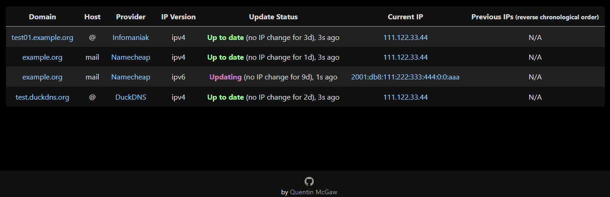
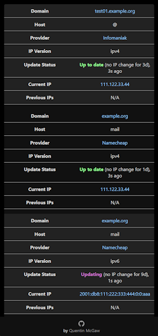

# Lightweight universal DDNS Updater program

Program to keep DNS A and/or AAAA records updated for multiple DNS providers


[](https://github.com/qdm12/ddns-updater/actions/workflows/build.yml)

[](https://hub.docker.com/r/qmcgaw/ddns-updater)


[](https://hub.docker.com/r/qmcgaw/ddns-updater/tags?page=1&ordering=last_updated)


[](https://hub.docker.com/r/qmcgaw/ddns-updater/tags)

[](https://github.com/qdm12/ddns-updater/commits/main)
[](https://github.com/qdm12/ddns-updater/graphs/contributors)
[](https://github.com/qdm12/ddns-updater/pulls?q=is%3Apr+is%3Aclosed)
[](https://github.com/qdm12/ddns-updater/issues)
[](https://github.com/qdm12/ddns-updater/issues?q=is%3Aissue+is%3Aclosed)

[](https://github.com/qdm12/ddns-updater)


[](LICENSE)


## Versioned documentation

This readme and the [docs/](docs/) directory are **versioned** to match the program version:

| Version | Readme link | Docs link |
| --- | --- | --- |
| Latest | [README](https://github.com/qdm12/ddns-updater/blob/master/README.md) | [docs/](https://github.com/qdm12/ddns-updater/tree/master/docs) |
| `v2.7.0` | [README](https://github.com/qdm12/ddns-updater/blob/v2.7.0/README.md) | [docs/](https://github.com/qdm12/ddns-updater/blob/v2.7.0/docs) |
| `v2.6.1` | [README](https://github.com/qdm12/ddns-updater/blob/v2.6.1/README.md) | [docs/](https://github.com/qdm12/ddns-updater/blob/v2.6.1/docs) |
| `v2.5.0` | [README](https://github.com/qdm12/ddns-updater/blob/v2.5.0/README.md) | [docs/](https://github.com/qdm12/ddns-updater/blob/v2.5.0/docs) |

## Features

- Available as a Docker image [`qmcgaw/ddns-updater`](https://hub.docker.com/r/qmcgaw/ddns-updater) and [`ghcr.io/qdm12/ddns-updater`]((https://github.com/qdm12/ddns-updater/pkgs/container/ddns-updater))
- 🆕 Available as [zero-dependency binaries for Linux, Windows and MacOS](https://github.com/qdm12/ddns-updater/releases)
- Updates periodically A records for different DNS providers:
  - Aliyun
  - AllInkl
  - Changeip
  - Cloudflare
  - DD24
  - DDNSS.de
  - deSEC
  - DigitalOcean
  - DonDominio
  - DNSOMatic
  - DNSPod
  - Dreamhost
  - DuckDNS
  - DynDNS
  - Dynu
  - EasyDNS
  - FreeDNS
  - Gandi
  - GCP
  - GoDaddy
  - GoIP.de
  - He.net
  - Hetzner
  - Infomaniak
  - INWX
  - Ionos
  - Linode
  - LuaDNS
  - Name.com
  - Namecheap
  - Netcup
  - NoIP
  - Now-DNS
  - Njalla
  - OpenDNS
  - OVH
  - Porkbun
  - Route53
  - Selfhost.de
  - Servercow.de
  - Spdyn
  - Strato.de
  - Variomedia.de
  - Zoneedit
  - **Want more?** [Create an issue for it](https://github.com/qdm12/ddns-updater/issues/new/choose)!
- Web user interface (Desktop)

    

- Web user interface (Mobile)

    

- Send notifications with [**Shoutrrr**](https://containrrr.dev/shoutrrr/v0.8/services/overview/) using `SHOUTRRR_ADDRESSES`
- Container (Docker/K8s) specific features:
  - Lightweight 12MB Docker image based on the Scratch Docker image
  - Docker healthcheck verifying the DNS resolution of your domains
  - Images compatible with `amd64`, `386`, `arm64`, `armv7`, `armv6`, `s390x`, `ppc64le`, `riscv64` CPU architectures
- Persistence with a JSON file *updates.json* to store old IP addresses with change times for each record

## Setup

### Binary programs

1. Download the pre-built program for your platform from the assets of a release in the [releases page](https://github.com/qdm12/ddns-updater/releases). You can alternatively download, build and install the latest version of the program by installing [Go](https://golang.org/doc/install) and then run `go install github.com/qdm12/ddns-updater/cmd/ddns-updater@latest`.
1. For Linux and MacOS, make the program executable with `chmod +x ddns-updater`.
1. In the directory where the program is saved, create a directory `data`.
1. Write a JSON configuration in `data/config.json`, for example:

    ```json
    {
        "settings": [
            {
                "provider": "namecheap",
                "domain": "sub.example.com",
                "password": "e5322165c1d74692bfa6d807100c0310"
            }
        ]
    }
    ```

    You can find more information in the [configuration section](#configuration) to customize it.
1. Run the program with `./ddns-updater` (`./ddns-updater.exe` on Windows) or by double-clicking on it.
1. The following is **optional**.
    - You can customize the program behavior using either [environment variables](#environment-variables) or flags. For flags, there is a flag corresponding to each environment variable, where it's all lowercase and underscores are replaced with dashes. For example the environment variable `LOG_LEVEL` translates into `--log-level`.

### Container

[➡️ Qnap guide by @Araminta](https://github.com/qdm12/ddns-updater/issues/708)

1. Create a directory, for example, *data* which is:
    - owned by user id `1000`, which is the built-in user ID of the ddns-updater container
    - has user read+write+execute permissions

    ```sh
    mkdir data
    chown 1000 data
    chmod u+r+w+x data
    ```

    If you want to use another user ID, [build the image yourself](#build-the-image) with `--build-arg UID=<your-uid>`. You could also just run the container as root with `--user="0"` but this is not advised security wise.

1. Similarly, create a *data/config.json* file which is:
    - owned by user id `1000`
    - has user read permissions

    ```sh
    touch data/config.json
    chmod u+r data/config.json
    ```

1. Edit *data/config.json*, for example:

    ```json
    {
        "settings": [
            {
                "provider": "namecheap",
                "domain": "sub.example.com",
                "password": "e5322165c1d74692bfa6d807100c0310"
            }
        ]
    }
    ```

    You can find more information in the [configuration section](#configuration) to customize it.

1. Run the container with

    ```sh
    docker run -d -p 8000:8000/tcp -v "$(pwd)"/data:/updater/data qmcgaw/ddns-updater
    ```

1. The following is **optional**.
    - You can customize the program behavior using [environment variables](#environment-variables)
    - You can use [docker-compose.yml](docker-compose.yml) with `docker-compose up -d`
    - **Kubernetes**: check out the [k8s directory](k8s) for an installation guide and examples.
    - Other [Docker image tags are available](https://hub.docker.com/repository/docker/qmcgaw/ddns-updater/tags)
    - You can update the image with `docker pull qmcgaw/ddns-updater`
    - You can set your JSON configuration as a single environment variable line (i.e. `{"settings": [{"provider": "namecheap", ...}]}`), which takes precedence over config.json. Note however that if you don't bind mount the `/updater/data` directory, there won't be a persistent database file `/updater/updates.json` but it will still work.

## Configuration

Start by having the following content in *config.json*, or in your `CONFIG` environment variable:

```json
{
    "settings": [
        {
            "provider": "",
        },
        {
            "provider": "",
        }
    ]
}
```

For each setting, you need to fill in parameters.
Check the documentation for your DNS provider:

- [Aliyun](docs/aliyun.md)
- [Allinkl](docs/allinkl.md)
- [ChangeIP](docs/changeip.md)
- [Cloudflare](docs/cloudflare.md)
- [Custom](docs/custom.md)
- [DDNSS.de](docs/ddnss.de.md)
- [deSEC](docs/desec.md)
- [DigitalOcean](docs/digitalocean.md)
- [DD24](docs/dd24.md)
- [DonDominio](docs/dondominio.md)
- [DNSOMatic](docs/dnsomatic.md)
- [DNSPod](docs/dnspod.md)
- [Dreamhost](docs/dreamhost.md)
- [DuckDNS](docs/duckdns.md)
- [DynDNS](docs/dyndns.md)
- [Dynu](docs/dynu.md)
- [DynV6](docs/dynv6.md)
- [EasyDNS](docs/easydns.md)
- [FreeDNS](docs/freedns.md)
- [Gandi](docs/gandi.md)
- [GCP](docs/gcp.md)
- [GoDaddy](docs/godaddy.md)
- [GoIP.de](docs/goip.md)
- [He.net](docs/he.net.md)
- [Infomaniak](docs/infomaniak.md)
- [INWX](docs/inwx.md)
- [Ionos](docs/ionos.md)
- [Linode](docs/linode.md)
- [LuaDNS](docs/luadns.md)
- [Name.com](docs/name.com.md)
- [Namecheap](docs/namecheap.md)
- [Netcup](docs/netcup.md)
- [NoIP](docs/noip.md)
- [Now-DNS](docs/nowdns.md)
- [Njalla](docs/njalla.md)
- [OpenDNS](docs/opendns.md)
- [OVH](docs/ovh.md)
- [Porkbun](docs/porkbun.md)
- [Selfhost.de](docs/selfhost.de.md)
- [Servercow.de](docs/servercow.md)
- [Spdyn](docs/spdyn.md)
- [Strato.de](docs/strato.md)
- [Variomedia.de](docs/variomedia.md)
- [Zoneedit](docs/zoneedit.md)

Note that:

- you can specify multiple owners/hosts for the same domain using a comma separated list. For example with `"domain": "example.com,sub.example.com,sub2.example.com",`.

### Environment variables

🆕 There are now flags equivalent for each variable below, for example `--log-level`.

| Environment variable | Default | Description |
| --- | --- | --- |
| `CONFIG` | | One line JSON object containing the entire config (takes precedence over config.json file) if specified |
| `PERIOD` | `5m` | Default period of IP address check, following [this format](https://golang.org/pkg/time/#ParseDuration) |
| `PUBLICIP_FETCHERS` | `all` | Comma separated fetcher types to obtain the public IP address from `http` and `dns` |
| `PUBLICIP_HTTP_PROVIDERS` | `all` | Comma separated providers to obtain the public IP address (ipv4 or ipv6). See the [Public IP section](#public-ip) |
| `PUBLICIPV4_HTTP_PROVIDERS` | `all` | Comma separated providers to obtain the public IPv4 address only. See the [Public IP section](#public-ip) |
| `PUBLICIPV6_HTTP_PROVIDERS` | `all` | Comma separated providers to obtain the public IPv6 address only. See the [Public IP section](#public-ip) |
| `PUBLICIP_DNS_PROVIDERS` | `all` | Comma separated providers to obtain the public IP address (IPv4 and/or IPv6). See the [Public IP section](#public-ip) |
| `PUBLICIP_DNS_TIMEOUT` | `3s` | Public IP DNS query timeout |
| `UPDATE_COOLDOWN_PERIOD` | `5m` | Duration to cooldown between updates for each record. This is useful to avoid being rate limited or banned. |
| `HTTP_TIMEOUT` | `10s` | Timeout for all HTTP requests |
| `SERVER_ENABLED` | `yes` | Enable the web server and web UI |
| `LISTENING_ADDRESS` | `:8000` | Internal TCP listening port for the web UI |
| `ROOT_URL` | `/` | URL path to append to all paths to the webUI (i.e. `/ddns` for accessing `https://example.com/ddns` through a proxy) |
| `HEALTH_SERVER_ADDRESS` | `127.0.0.1:9999` | Health server listening address |
| `HEALTH_HEALTHCHECKSIO_BASE_URL` | `https://hc-ping.com` | Base URL for the [healthchecks.io](https://healthchecks.io) server |
| `HEALTH_HEALTHCHECKSIO_UUID` | | UUID to idenfity with the [healthchecks.io](https://healthchecks.io) server |
| `DATADIR` | `/updater/data` | Directory to read and write data files from internally |
| `CONFIG_FILEPATH` | `/updater/data/config.json` | Path to the JSON configuration file |
| `BACKUP_PERIOD` | `0` | Set to a period (i.e. `72h15m`) to enable zip backups of data/config.json and data/updates.json in a zip file |
| `BACKUP_DIRECTORY` | `/updater/data` | Directory to write backup zip files to if `BACKUP_PERIOD` is not `0`. |
| `RESOLVER_ADDRESS` | Your network DNS | A plaintext DNS address to use to resolve your domain names defined in your settings only. For example it can be `1.1.1.1:53`. This is useful for split dns, see [#389](https://github.com/qdm12/ddns-updater/issues/389) |
| `LOG_LEVEL` | `info` | Level of logging, `debug`, `info`, `warning` or `error` |
| `LOG_CALLER` | `hidden` | Show caller per log line, `hidden` or `short` |
| `SHOUTRRR_ADDRESSES` |  | (optional) Comma separated list of [Shoutrrr addresses](https://containrrr.dev/shoutrrr/v0.8/services/overview/) (notification services) |
| `SHOUTRRR_DEFAULT_TITLE` | `DDNS Updater` | Default title for Shoutrrr notifications |
| `TZ` | | Timezone to have accurate times, i.e. `America/Montreal` |

#### Public IP

By default, all public IP fetching types are used and cycled (over DNS and over HTTPs).

On top of that, for each fetching method, all echo services available are cycled on each request.

This allows you not to be blocked for making too many requests.

You can otherwise customize it with the following:

- `PUBLICIP_HTTP_PROVIDERS` gets your public IPv4 or IPv6 address. It can be one or more of the following:
  - `ipify` using [https://api64.ipify.org](https://api64.ipify.org)
  - `ifconfig` using [https://ifconfig.io/ip](https://ifconfig.io/ip)
  - `ipinfo` using [https://ipinfo.io/ip](https://ipinfo.io/ip)
  - `google` using [https://domains.google.com/checkip](https://domains.google.com/checkip)
  - `spdyn` using [https://checkip.spdyn.de](https://checkip.spdyn.de/)
  - `ipleak` using [https://ipleak.net/json](https://ipleak.net/json)
  - `icanhazip` using [https://icanhazip.com](https://icanhazip.com)
  - `ident` using [https://ident.me](https://ident.me)
  - `nnev` using [https://ip.nnev.de](https://ip.nnev.de)
  - `wtfismyip` using [https://wtfismyip.com/text](https://wtfismyip.com/text)
  - `seeip` using [https://api.seeip.org](https://api.seeip.org)
  - `changeip` using [https://ip.changeip.com](https://ip.changeip.com)
  - You can also specify an HTTPS URL with prefix `url:` for example `url:https://ipinfo.io/ip`
- `PUBLICIPV4_HTTP_PROVIDERS` gets your public IPv4 address only. It can be one or more of the following:
  - `ipleak` using [https://ipv4.ipleak.net/json](https://ipv4.ipleak.net/json)
  - `ipify` using [https://api.ipify.org](https://api.ipify.org)
  - `icanhazip` using [https://ipv4.icanhazip.com](https://ipv4.icanhazip.com)
  - `ident` using [https://v4.ident.me](https://v4.ident.me)
  - `nnev` using [https://ip4.nnev.de](https://ip4.nnev.de)
  - `wtfismyip` using [https://ipv4.wtfismyip.com/text](https://ipv4.wtfismyip.com/text)
  - `seeip` using [https://ipv4.seeip.org](https://ipv4.seeip.org)
  - You can also specify an HTTPS URL with prefix `url:` for example `url:https://ipinfo.io/ip`
- `PUBLICIPV6_HTTP_PROVIDERS` gets your public IPv6 address only. It can be one or more of the following:
  - `ipleak` using [https://ipv6.ipleak.net/json](https://ipv6.ipleak.net/json)
  - `ipify` using [https://api6.ipify.org](https://api6.ipify.org)
  - `icanhazip` using [https://ipv6.icanhazip.com](https://ipv6.icanhazip.com)
  - `ident` using [https://v6.ident.me](https://v6.ident.me)
  - `nnev` using [https://ip6.nnev.de](https://ip6.nnev.de)
  - `wtfismyip` using [https://ipv6.wtfismyip.com/text](https://ipv6.wtfismyip.com/text)
  - `seeip` using [https://ipv6.seeip.org](https://ipv6.seeip.org)
  - You can also specify an HTTPS URL with prefix `url:` for example `url:https://ipinfo.io/ip`
- `PUBLICIP_DNS_PROVIDERS` gets your public IPv4 address only or IPv6 address only or one of them (see #136). It can be one or more of the following:
  - `cloudflare`
  - `opendns`

### Host firewall

If you have a host firewall in place, this container needs the following ports:

- TCP 443 outbound for outbound HTTPS
- UDP 53 outbound for outbound DNS resolution
- TCP 8000 inbound (or other) for the WebUI

## Architecture

At program start and every period (5 minutes by default):

1. Fetch your public IP address
1. For each record:
    1. DNS resolve it to obtain its current IP address(es)
        - If the resolution fails, update the record with your public IP address by calling the DNS provider API and finish
    1. Check if your public IP address is within the resolved IP addresses
        - Yes: skip the update
        - No: update the record with your public IP address by calling the DNS provider API

💡 We do DNS resolution every period so it detects a change made to the record manually, for example on the DNS provider web UI
💡 As DNS resolutions are essentially free and without rate limiting, these are great to avoid getting banned for too many requests.

### Special case: Cloudflare

For Cloudflare records with the `proxied` option, the following is done.

At program start and every period (5 minutes by default), for each record:

1. Fetch your public IP address
1. For each record:
    1. Check the last IP address (persisted in `updates.json`) for that record
        - If it doesn't exist, update the record with your public IP address by calling the DNS provider API and finish
    1. Check if your public IP address matches the last IP address you updated the record with
        - Yes: skip the update
        - No: update the record with your public IP address by calling the DNS provider API

This is the only way as doing a DNS resolution on the record will give the IP address of a Cloudflare server instead of your server.

⚠️ This has the disadvantage that if the record is changed manually, the program will not detect it.
We could do an API call to get the record IP address every period, but that would get you banned especially with a low period duration.

## Testing

- The automated healthcheck verifies all your records are up to date [using DNS lookups](internal/health/check.go#L42)
- You can also manually check, by:
    1. Going to your DNS management webpage
    1. Setting your record to `127.0.0.1`
    1. Run the container
    1. Refresh the DNS management webpage and verify the update happened

## Build the image

You can build the image yourself with:

```sh
docker build -t qmcgaw/ddns-updater https://github.com/qdm12/ddns-updater.git
```

You can use optional build arguments with `--build-arg KEY=VALUE` from the table below:

| Build argument | Default | Description |
| --- | --- | --- |
| `UID` | `1000` | User ID running the container |
| `GID` | `1000` | User group ID running the container |
| `VERSION` | `unknown` | Version of the program and Docker image |
| `CREATED` | `an unknown date` | Build date of the program and Docker image |
| `COMMIT` | `unknown` | Commit hash of the program and Docker image |

## Development and contributing

- [Contribute with code](.github/CONTRIBUTING.md)
- [Github workflows to know what's building](https://github.com/qdm12/ddns-updater/actions)
- [List of issues and feature requests](https://github.com/qdm12/ddns-updater/issues)
- [Kanban board](https://github.com/qdm12/ddns-updater/projects/1)

## License

This repository is under an [MIT license](LICENSE)

## Used in external projects

- [Starttoaster/docker-traefik](https://github.com/Starttoaster/docker-traefik#home-networks-extra-credit-dynamic-dns)

## Support

Sponsor me on [Github](https://github.com/sponsors/qdm12) or donate to [paypal.me/qmcgaw](https://www.paypal.me/qmcgaw)

Many thanks to J. Famiglietti for supporting me financially 🥇👍
