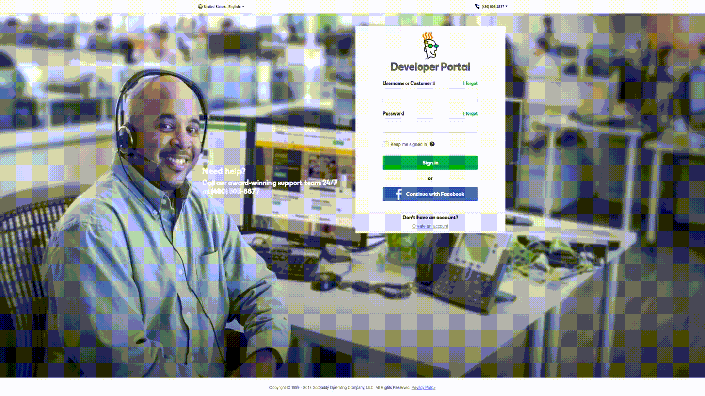
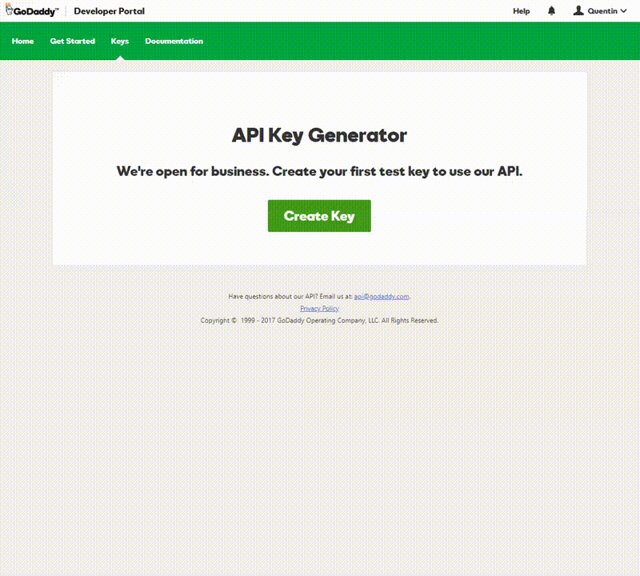
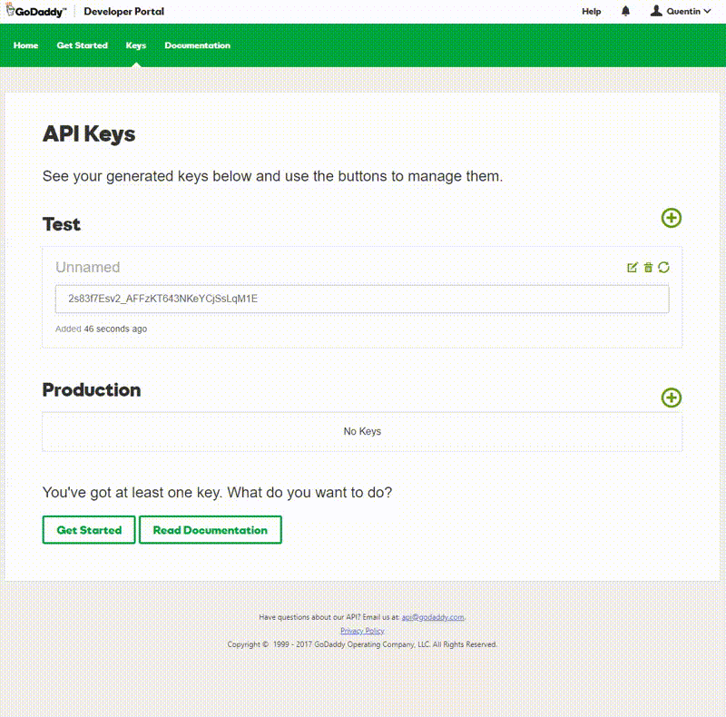
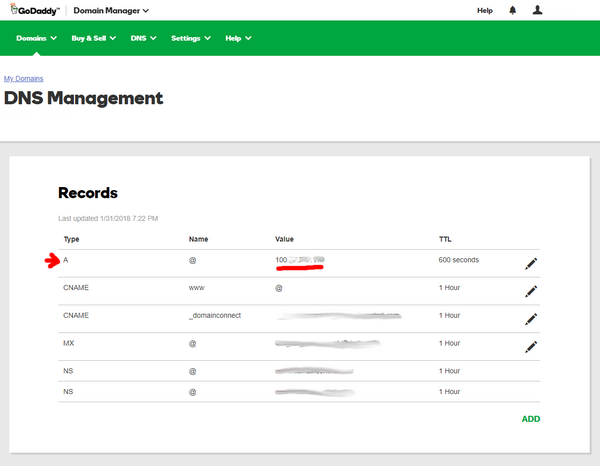

# GoDaddy

## Configuration

### Example

```json
{
  "settings": [
    {
      "provider": "godaddy",
      "domain": "domain.com",
      "host": "@",
      "key": "key",
      "secret": "secret",
      "ip_version": "ipv4"
    }
  ]
}
```

### Compulsory parameters

- `"domain"`
- `"host"` is your host and can be a subdomain, `"@"` or `"*"` generally
- `"key"`
- `"secret"`

### Optional parameters

- `"ip_version"` can be `ipv4` (A records) or `ipv6` (AAAA records), defaults to `ipv4 or ipv6`

## Domain setup

[](https://godaddy.com)

1. Login to [https://developer.godaddy.com/keys](https://developer.godaddy.com/keys/) with your account credentials.

[](https://developer.godaddy.com/keys)

1. Generate a Test key and secret.

[](https://developer.godaddy.com/keys)

1. Generate a **Production** key and secret.

[](https://developer.godaddy.com/keys)

Obtain the **key** and **secret** of that production key.

In this example, the key is `dLP4WKz5PdkS_GuUDNigHcLQFpw4CWNwAQ5` and the secret is `GuUFdVFj8nJ1M79RtdwmkZ`.

## Testing

1. Go to [https://dcc.godaddy.com/manage/yourdomain.com/dns](https://dcc.godaddy.com/manage/yourdomain.com/dns) (replace yourdomain.com)

    [](https://dcc.godaddy.com/manage/)

1. Change the IP address to `127.0.0.1`
1. Run the ddns-updater
1. Refresh the Godaddy webpage to check the update occurred.
