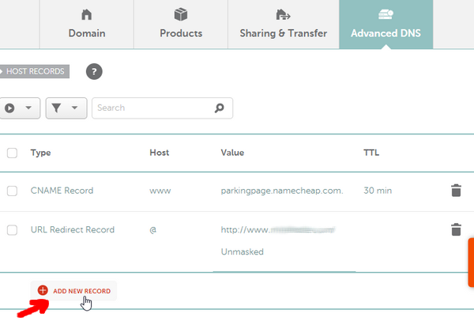
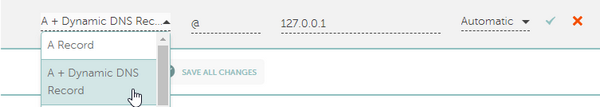
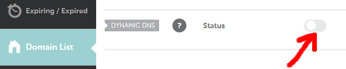
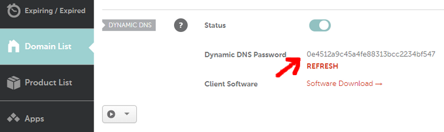

# Namecheap

## Configuration

### Example

```json
{
  "settings": [
    {
      "provider": "namecheap",
      "domain": "domain.com",
      "password": "password",
      "provider_ip": true
    }
  ]
}
```

### Compulsory parameters

- `"domain"` is the domain to update. It can be `example.com` (root domain), `sub.example.com` (subdomain of `example.com`) or `*.example.com` for the wildcard.
- `"password"`

### Optional parameters

- `"provider_ip"` can be set to `true` to let your DNS provider determine your IPv4 address (and/or IPv6 address) automatically when you send an update request, without sending the new IP address detected by the program in the request.

Note that Namecheap only supports ipv4 addresses for now.

## Domain setup

[](https://www.namecheap.com/)

1. Create a Namecheap account and buy a domain name - *example.com* as an example
1. Login to Namecheap at [https://www.namecheap.com/myaccount/login/](https://www.namecheap.com/myaccount/login/)

For **each domain name** you want to add, replace *example.com* in the following link with your domain name and go to [https://ap.www.namecheap.com/Domains/DomainControlPanel/**example.com**/advancedns](https://ap.www.namecheap.com/Domains/DomainControlPanel/example.com/advancedns)

1. For each host you want to add (if you don't know, create one record with the host set to `*`):
    1. In the *HOST RECORDS* section, click on *ADD NEW RECORD*

        

    1. Select the following settings and create the *A + Dynamic DNS Record*:

        

1. Scroll down and turn on the switch for *DYNAMIC DNS*

    

1. The Dynamic DNS Password will appear, which is `0e4512a9c45a4fe88313bcc2234bf547` in this example.

    
