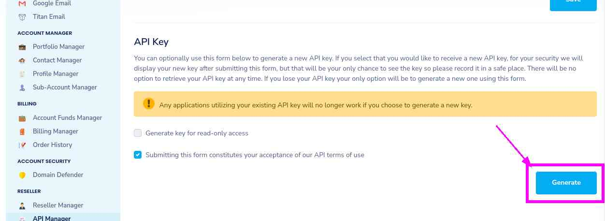
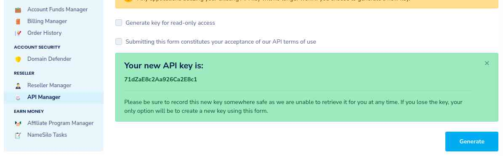

# NameSilo

[](https://www.namesilo.com)

## Configuration

### Example

```json
{
  "settings": [
    {
      "provider": "namesilo",
      "domain": "sub.example.com",
      "key": "71dZaE8c2Aa926Ca2E8c1",
      "ttl": 7207,
      "ip_version": "ipv4"
    }
  ]
}
```

### Compulsory parameters

- `"domain"` is the domain to update. It can be `example.com` (root domain), `sub.example.com` (subdomain of `example.com`) or `*.example.com` for the wildcard.
- `"key"` is the NameSilo API Key obtained using the domain setup instructions below. For example: `71dZaE8c2Aa926Ca2E8c1`.

### Optional parameters

- `"ip_version"` can be `ipv4` (A records), or `ipv6` (AAAA records) or `ipv4 or ipv6` (update one of the two, depending on the public ip found). It defaults to `ipv4 or ipv6`.
- `"ipv6_suffix"` is the IPv6 interface identifier suffix to use. It can be for example `0:0:0:0:72ad:8fbb:a54e:bedd/64`. If left empty, it defaults to no suffix and the raw public IPv6 address obtained is used in the record updating.
- `"ttl"` is the record's Time to Live (TTL), which defaults to `7207` seconds. It must be numeric, less than `2592001`, and greater than or equal to `3600`. TTL values of `3603` or `7207` may be subject to NameSilo's [Automatic TTL Adjustments](https://www.namesilo.com/support/v2/articles/domain-manager/dns-manager#auto_ttl).

## Domain setup

1. Login to the [Namesilo API Manager](https://www.namesilo.com/account/api-manager) with your account credentials.
1. Generate an API key. The generated API key will look similar to `71dZaE8c2Aa926Ca2E8c1`.
    - (do _not_ check the "Generate key for read-only access" box)

    [](https://www.namesilo.com/account/api-manager)
    [](https://www.namesilo.com/account/api-manager)

## Testing

1. Go to the [NameSilo Domain Manager](https://www.namesilo.com/account_domains.php).
1. Choose "Manage DNS for this domain" (the globe icon) for the domain you wish to test.
    [](https://www.namesilo.com/account_domains.php)

1. Change the IP address of the host to `127.0.0.1`.
1. Run the ddns-updater.
1. Refresh the Namesilo webpage to check the update occurred.
